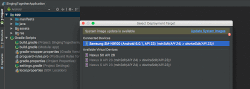

# Singing together

- Need to target lower




- Need to fix this


```
04-08 11:48:28.418 3496-3496/? E/AndroidRuntime: FATAL EXCEPTION: main
    Process: com.example.rpm.sing, PID: 3496
    java.lang.RuntimeException: Unable to start activity ComponentInfo{com.example.rpm.sing/com.example.rpm.sing.MainActivity}: java.lang.ArrayIndexOutOfBoundsException: length=1; index=1
        at android.app.ActivityThread.performLaunchActivity(ActivityThread.java:3253)
        at android.app.ActivityThread.handleLaunchActivity(ActivityThread.java:3349)
        at android.app.ActivityThread.access$1100(ActivityThread.java:221)
        at android.app.ActivityThread$H.handleMessage(ActivityThread.java:1794)
        at android.os.Handler.dispatchMessage(Handler.java:102)
        at android.os.Looper.loop(Looper.java:158)
        at android.app.ActivityThread.main(ActivityThread.java:7225)
        at java.lang.reflect.Method.invoke(Native Method)
        at com.android.internal.os.ZygoteInit$MethodAndArgsCaller.run(ZygoteInit.java:1230)
        at com.android.internal.os.ZygoteInit.main(ZygoteInit.java:1120)
     Caused by: java.lang.ArrayIndexOutOfBoundsException: length=1; index=1
        at com.example.rpm.sing.SongFragment.initRecordSong(SongFragment.java:75)
        at com.example.rpm.sing.SongFragment.onCreateView(SongFragment.java:40)
        at android.support.v4.app.Fragment.performCreateView(Fragment.java:2343)
        at android.support.v4.app.FragmentManagerImpl.moveToState(FragmentManager.java:1421)
        at android.support.v4.app.FragmentManagerImpl.moveFragmentToExpectedState(FragmentManager.java:1752)
        at android.support.v4.app.FragmentManagerImpl.moveToState(FragmentManager.java:1821)
        at android.support.v4.app.BackStackRecord.executeOps(BackStackRecord.java:797)
        at android.support.v4.app.FragmentManagerImpl.executeOps(FragmentManager.java:2595)
        at android.support.v4.app.FragmentManagerImpl.executeOpsTogether(FragmentManager.java:2382)
        at android.support.v4.app.FragmentManagerImpl.removeRedundantOperationsAndExecute(FragmentManager.java:2337)
        at android.support.v4.app.FragmentManagerImpl.execPendingActions(FragmentManager.java:2244)
        at android.support.v4.app.FragmentManagerImpl.dispatchStateChange(FragmentManager.java:3255)
        at android.support.v4.app.FragmentManagerImpl.dispatchActivityCreated(FragmentManager.java:3205)
        at android.support.v4.app.FragmentController.dispatchActivityCreated(FragmentController.java:195)
        at android.support.v4.app.FragmentActivity.onStart(FragmentActivity.java:597)
        at android.support.v7.app.AppCompatActivity.onStart(AppCompatActivity.java:177)
        at android.app.Instrumentation.callActivityOnStart(Instrumentation.java:1265)
        at android.app.Activity.performStart(Activity.java:6915)
        at android.app.ActivityThread.performLaunchActivity(ActivityThread.java:3216)
        at android.app.ActivityThread.handleLaunchActivity(ActivityThread.java:3349) 
        at android.app.ActivityThread.access$1100(ActivityThread.java:221) 
        at android.app.ActivityThread$H.handleMessage(ActivityThread.java:1794) 
        at android.os.Handler.dispatchMessage(Handler.java:102) 
        at android.os.Looper.loop(Looper.java:158) 
        at android.app.ActivityThread.main(ActivityThread.java:7225) 
        at java.lang.reflect.Method.invoke(Native Method) 
        at com.android.internal.os.ZygoteInit$MethodAndArgsCaller.run(ZygoteInit.java:1230) 
        at com.android.internal.os.ZygoteInit.main(ZygoteInit.java:1120) 
04-08 11:48:36.738 3950-3950/com.example.rpm.sing E/AndroidRuntime: FATAL EXCEPTION: main
    Process: com.example.rpm.sing, PID: 3950
    java.lang.RuntimeException: Unable to start activity ComponentInfo{com.example.rpm.sing/com.example.rpm.sing.MainActivity}: java.lang.ArrayIndexOutOfBoundsException: length=1; index=1
        at android.app.ActivityThread.performLaunchActivity(ActivityThread.java:3253)
        at android.app.ActivityThread.handleLaunchActivity(ActivityThread.java:3349)
        at android.app.ActivityThread.access$1100(ActivityThread.java:221)
        at android.app.ActivityThread$H.handleMessage(ActivityThread.java:1794)
        at android.os.Handler.dispatchMessage(Handler.java:102)
        at android.os.Looper.loop(Looper.java:158)
        at android.app.ActivityThread.main(ActivityThread.java:7225)
        at java.lang.reflect.Method.invoke(Native Method)
        at com.android.internal.os.ZygoteInit$MethodAndArgsCaller.run(ZygoteInit.java:1230)
        at com.android.internal.os.ZygoteInit.main(ZygoteInit.java:1120)
     Caused by: java.lang.ArrayIndexOutOfBoundsException: length=1; index=1
        at com.example.rpm.sing.SongFragment.initRecordSong(SongFragment.java:75)
        at com.example.rpm.sing.SongFragment.onCreateView(SongFragment.java:40)
        at android.support.v4.app.Fragment.performCreateView(Fragment.java:2343)
        at android.support.v4.app.FragmentManagerImpl.moveToState(FragmentManager.java:1421)
        at android.support.v4.app.FragmentManagerImpl.moveFragmentToExpectedState(FragmentManager.java:1752)
        at android.support.v4.app.FragmentManagerImpl.moveToState(FragmentManager.java:1821)
        at android.support.v4.app.BackStackRecord.executeOps(BackStackRecord.java:797)
        at android.support.v4.app.FragmentManagerImpl.executeOps(FragmentManager.java:2595)
        at android.support.v4.app.FragmentManagerImpl.executeOpsTogether(FragmentManager.java:2382)
        at android.support.v4.app.FragmentManagerImpl.removeRedundantOperationsAndExecute(FragmentManager.java:2337)
        at android.support.v4.app.FragmentManagerImpl.execPendingActions(FragmentManager.java:2244)
        at android.support.v4.app.FragmentManagerImpl.dispatchStateChange(FragmentManager.java:3255)
        at android.support.v4.app.FragmentManagerImpl.dispatchActivityCreated(FragmentManager.java:3205)
        at android.support.v4.app.FragmentController.dispatchActivityCreated(FragmentController.java:195)
        at android.support.v4.app.FragmentActivity.onStart(FragmentActivity.java:597)
        at android.support.v7.app.AppCompatActivity.onStart(AppCompatActivity.java:177)
        at android.app.Instrumentation.callActivityOnStart(Instrumentation.java:1265)
        at android.app.Activity.performStart(Activity.java:6915)
        at android.app.ActivityThread.performLaunchActivity(ActivityThread.java:3216)
        at android.app.ActivityThread.handleLaunchActivity(ActivityThread.java:3349) 
        at android.app.ActivityThread.access$1100(ActivityThread.java:221) 
        at android.app.ActivityThread$H.handleMessage(ActivityThread.java:1794) 
        at android.os.Handler.dispatchMessage(Handler.java:102) 
        at android.os.Looper.loop(Looper.java:158) 
        at android.app.ActivityThread.main(ActivityThread.java:7225) 
        at java.lang.reflect.Method.invoke(Native Method) 
        at com.android.internal.os.ZygoteInit$MethodAndArgsCaller.run(ZygoteInit.java:1230) 
        at com.android.internal.os.ZygoteInit.main(ZygoteInit.java:1120) 
```